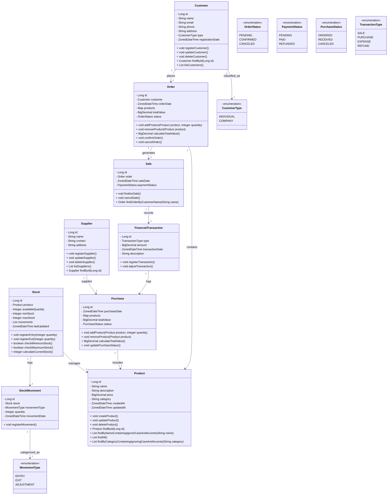

# 🌟 Desafio-DIO-Decola-Tech-2025

Este projeto consiste no desenvolvimento de uma API para o gerenciamento de uma loja de eletrônicos e serviços de assistência técnica. A solução permitirá um controle eficiente de produtos, estoque, vendas, ordens de serviço e atendimento ao cliente, proporcionando uma gestão integrada e otimizada para o negócio. 🛒💻

## 📜 Descrição do Projeto

A API permitirá a gestão de produtos, controle de estoque, processamento de pedidos e outras funcionalidades essenciais para o funcionamento eficiente de uma loja de eletrônicos, proporcionando uma experiência aprimorada para os usuários e facilitando a operação do negócio. 🚀

## 📊 Diagrama de Classes

Abaixo está o diagrama de classes que representa a estrutura do projeto e as relações entre as entidades:

## ✅ Funcionalidades
🏷️ Cadastro e gerenciamento de produtos     
📦 Controle de estoque   
📝 Processamento de pedidos   
👥 Gerenciamento de clientes    
💰 Registro de movimentações financeiras  
📄 Emissão de faturas 

## 🚀 Padrões de Commits

Adotado os seguintes prefixos para descrever o propósito de cada commit:

✨ feat: Nova funcionalidade. 
🐛 fix: Correção de bugs.  
📝 docs: Alterações na documentação. 
💅 style: Mudanças que não afetam a lógica do código (formatação, espaços, etc.). 
🔨 refactor: Melhorias na estrutura do código sem adicionar funcionalidades ou corrigir bugs. 
✅ test: Adição ou modificação de testes. 
🧹 chore: Tarefas de manutenção (configurações, dependências, etc.) 

## 📄 Licença  
Este projeto é licenciado sob a **Licença de Uso Não Comercial e Sem Alterações**. Você pode usar, copiar e distribuir o código-fonte e a documentação associados a este software exclusivamente para **fins de estudo**, desde que faça isso de forma não comercial. Para mais informações, consulte o arquivo LICENSE.

## 👤 Sobre o Autor

🔧 **Desenvolvedor:** Silas Sefas de Souza Aquino  
🌐 **LinkedIn:** [silassefas](https://www.linkedin.com/in/silassefas/)  
:octocat: **GitHub:** [silassefas1](https://github.com/silassefas1)
Sinta-se à vontade para me conectar nas redes sociais! Estou sempre aberto a novas oportunidades e colaborações. 🚀

## ⚠ Aviso

Este projeto é de caráter **educacional** e está em constante desenvolvimento.  
Mudanças significativas podem ocorrer ao longo do tempo, incluindo ajustes na estrutura, funcionalidades e até mesmo na tecnologia utilizada.

Sinta-se à vontade para contribuir e melhorar o projeto! Quaisquer sugestões ou colaborações são bem-vindas. 😊  
