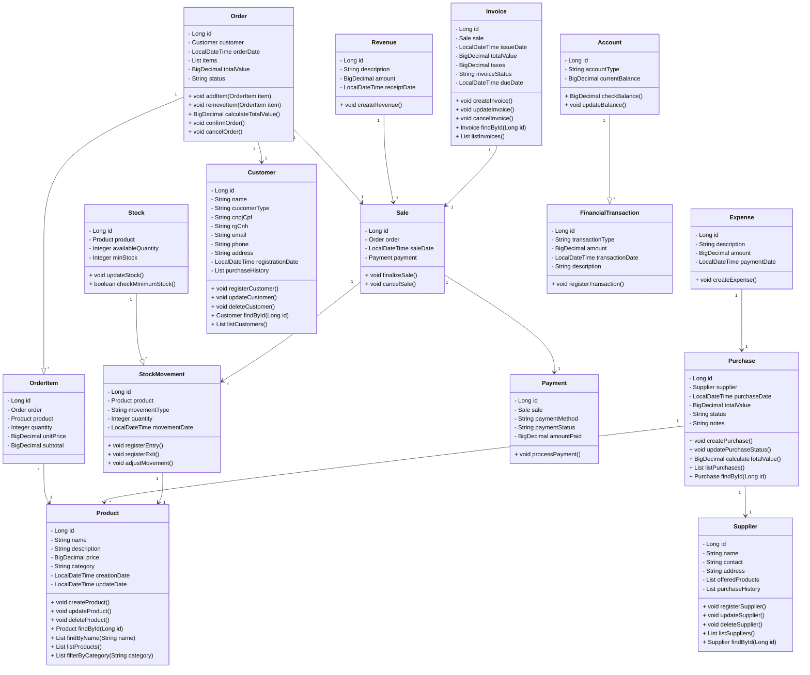

# 🌟 Desafio-DIO-Decola-Tech-2025

Este projeto é baseado em uma ideia que tive há algum tempo e, agora, com o conhecimento adquirido, estou colocando-a em prática. O objetivo deste projeto é desenvolver uma API de gerenciamento para uma loja de eletrônicos e assistência técnica. 🛒💻

## 📜 Descrição do Projeto

A API permitirá a gestão de produtos, controle de estoque, processamento de pedidos e outras funcionalidades essenciais para o funcionamento eficiente de uma loja de eletrônicos, proporcionando uma experiência aprimorada para os usuários e facilitando a operação do negócio. 🚀

## 📊 Diagrama de Classes

Abaixo está o diagrama de classes que representa a estrutura do projeto e as relações entre as entidades:

```mermaid
classDiagram
    class Product {
        - Long id
        - String name
        - String description
        - BigDecimal price
        - String category
        - LocalDateTime creationDate
        - LocalDateTime updateDate
        + void createProduct()
        + void updateProduct()
        + void deleteProduct()
        + Product findById(Long id)
        + List<Product> findByName(String name)
        + List<Product> listProducts()
        + List<Product> filterByCategory(String category)
    }
    class Stock {
        - Long id
        - Product product
        - Integer availableQuantity
        - Integer minStock
        + void updateStock()
        + boolean checkMinimumStock()
    }
    class StockMovement {
        - Long id
        - Product product
        - String movementType
        - Integer quantity
        - LocalDateTime movementDate
        + void registerEntry()
        + void registerExit()
        + void adjustMovement()
    }
    class Order {
        - Long id
        - Customer customer
        - LocalDateTime orderDate
        - List<OrderItem> items
        - BigDecimal totalValue
        - String status
        + void addItem(OrderItem item)
        + void removeItem(OrderItem item)
        + BigDecimal calculateTotalValue()
        + void confirmOrder()
        + void cancelOrder()
    }
    class Sale {
        - Long id
        - Order order
        - LocalDateTime saleDate
        - Payment payment
        + void finalizeSale()
        + void cancelSale()
    }
    class OrderItem {
        - Long id
        - Order order
        - Product product
        - Integer quantity
        - BigDecimal unitPrice
        - BigDecimal subtotal
    }
    class Payment {
        - Long id
        - Sale sale
        - String paymentMethod
        - String paymentStatus
        - BigDecimal amountPaid
        + void processPayment()
    }
    class Customer {
        - Long id
        - String name
        - String customerType
        - String cnpjCpf
        - String rgCnh
        - String email
        - String phone
        - String address
        - LocalDateTime registrationDate
        - List<Sale> purchaseHistory
        + void registerCustomer()
        + void updateCustomer()
        + void deleteCustomer()
        + Customer findById(Long id)
        + List<Customer> listCustomers()
    }
    class Revenue {
        - Long id
        - String description
        - BigDecimal amount
        - LocalDateTime receiptDate
        + void createRevenue()
    }
    class Expense {
        - Long id
        - String description
        - BigDecimal amount
        - LocalDateTime paymentDate
        + void createExpense()
    }
    class FinancialTransaction {
        - Long id
        - String transactionType
        - BigDecimal amount
        - LocalDateTime transactionDate
        - String description
        + void registerTransaction()
    }
    class Account {
        - Long id
        - String accountType
        - BigDecimal currentBalance
        + BigDecimal checkBalance()
        + void updateBalance()
    }
    class Invoice {
        - Long id
        - Sale sale
        - LocalDateTime issueDate
        - BigDecimal totalValue
        - BigDecimal taxes
        - String invoiceStatus
        - LocalDateTime dueDate
        + void createInvoice()
        + void updateInvoice()
        + void cancelInvoice()
        + Invoice findById(Long id)
        + List<Invoice> listInvoices()
    }
    class Purchase {
        - Long id
        - Supplier supplier
        - LocalDateTime purchaseDate
        - BigDecimal totalValue
        - String status
        - String notes
        + void createPurchase()
        + void updatePurchaseStatus()
        + BigDecimal calculateTotalValue()
        + List<Purchase> listPurchases()
        + Purchase findById(Long id)
    }
    class Supplier {
        - Long id
        - String name
        - String contact
        - String address
        - List<Product> offeredProducts
        - List<Purchase> purchaseHistory
        + void registerSupplier()
        + void updateSupplier()
        + void deleteSupplier()
        + List<Supplier> listSuppliers()
        + Supplier findById(Long id)
    }
    
    Order "1" --|> "*" OrderItem
    Order "1" --> "1" Customer
    Order "1" --> "1" Sale
    Sale "1" --> "1" Payment
    OrderItem "*" --> "1" Product
    Revenue "1" --> "1" Sale
    Expense "1" --> "1" Purchase
    Account "1" --|> "*" FinancialTransaction
    Invoice "1" --> "1" Sale
    Purchase "1" --> "1" Supplier
    Purchase "1" --> "*" Product
    Stock "1" --|> "*" StockMovement
    StockMovement "1" --> "1" Product
    Sale "1" --> "*" StockMovement


```
## ✅ Funcionalidades
🏷️ Cadastro e gerenciamento de produtos     
📦 Controle de estoque   
📝 Processamento de pedidos   
👥 Gerenciamento de clientes    
💰 Registro de movimentações financeiras  
📄 Emissão de faturas 

# 🚀 Padrões de Commits

Adotado os seguintes prefixos para descrever o propósito de cada commit:

✨ feat: Nova funcionalidade.
🐛 fix: Correção de bugs.
📝 docs: Alterações na documentação.
💅 style: Mudanças que não afetam a lógica do código (formatação, espaços, etc.).
🔨 refactor: Melhorias na estrutura do código sem adicionar funcionalidades ou corrigir bugs.
✅ test: Adição ou modificação de testes.
🧹 chore: Tarefas de manutenção (configurações, dependências, etc.)

## 📄 Licença  
Este projeto é licenciado sob a **Licença de Uso Não Comercial e Sem Alterações**. Você pode usar, copiar e distribuir o código-fonte e a documentação associados a este software exclusivamente para **fins de estudo**, desde que faça isso de forma não comercial. Para mais informações, consulte o arquivo LICENSE.

## 👤 Sobre o Autor

🔧 **Desenvolvedor:** Silas Sefas de Souza Aquino  
🌐 **LinkedIn:** [silassefas](https://www.linkedin.com/in/silassefas/)  
:octocat: **GitHub:** [silassefas1](https://github.com/silassefas1)

Sinta-se à vontade para me conectar nas redes sociais! Estou sempre aberto a novas oportunidades e colaborações. 🚀

Sinta-se à vontade para contribuir e melhorar o projeto! Quaisquer sugestões ou colaborações são bem-vindas. 😊  
